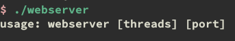
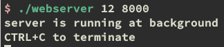
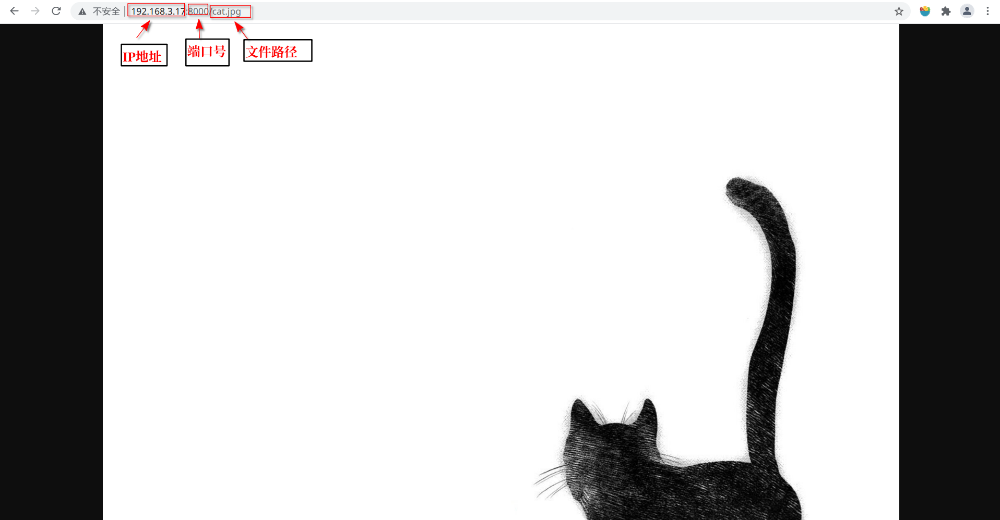

 

# Multi-thread Web Server developed by C++

## 平台说明

由于项目中使用的socket是unix特有的标准，因此服务器只能运行在类unix系统中，无法在windows平台上运行

## 编译配置说明

项目使用CMake构建工具，推荐使用Out-of-source外部编译，即在CMakeList.txt所在目录下新建build文件夹，在build文件夹路径下输入

```bash
cmake ..
```

 进行项目构建

CMake版本：3.16以上（如果CMake版本低，可尝试将CMakeList.txt中的 

```cmake
cmake_minimum_required(VERSION 3.16)
```

改为当前系统CMake版本

产品：Makefile文件

下面输入

```shell
make
```

进行编译。

本项目采用原生c++17标准写成，没有依赖任何第三方库。编译完成后即可运行。

## 使用说明

在编译成功后文件夹下产生webserver可执行文件



### 参数说明：

- threads: 线程池大小
- port:服务器运行端口号

### Example



服务器开启了12个线程的线程池在8000端口下运行。

在与webserver同级的目录为URL根目录，将文件放入目录中，开启服务器后在浏览器中输入相应URL即可访问。



# 项目测试文件都存放在res文件夹下

